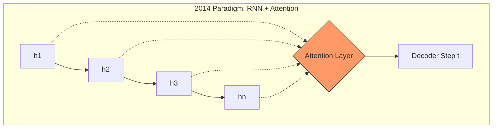
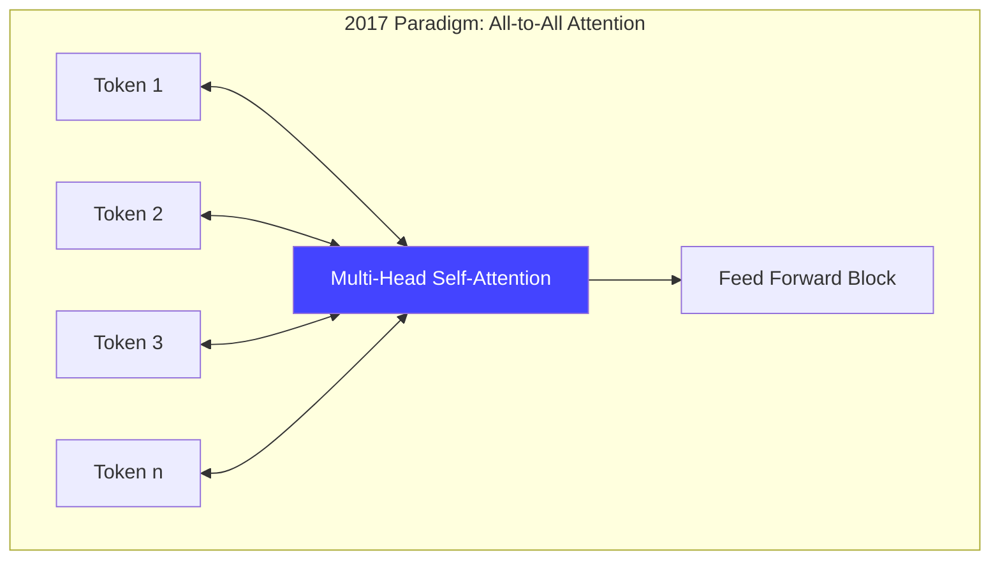
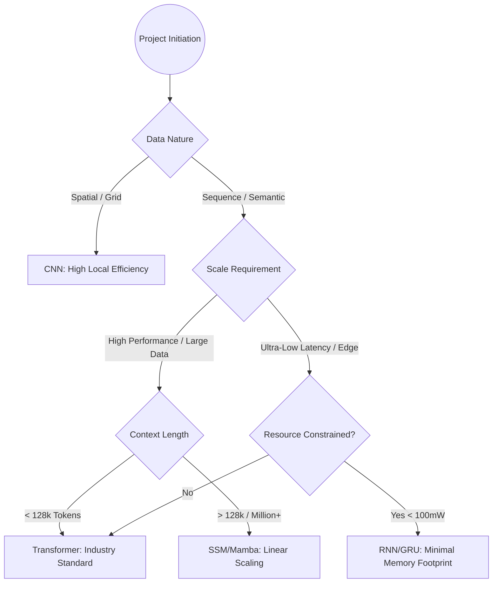

This technical memorandum outlines the architectural evolution of attention mechanisms, transitioning from auxiliary components in recurrent frameworks to the foundational backbone of modern Large Language Models (LLMs).

---

# Technical Report: The Evolution of Attention Mechanisms and Architectural Selection Criteria

## 1. 2014: The "Additive Attention" Breakthrough (Bahdanau et al.)
The 2014 introduction of attention was not a failure of vision, but a solution to the **Information Bottleneck** inherent in fixed-length vector representations.

*   **Technical Constraint:** Traditional Encoder-Decoder RNNs (Sutskever et al.) forced the compression of a variable-length input sequence $$S$$ into a single hidden state vector $$h$$. This resulted in significant vanishing gradients and information loss for sequences where $$|S| > h_{dim}$$.
*   **The Innovation:** **Additive Attention** (also known as Bahdanau Attention, 2014). It introduced a learned alignment function that allowed the decoder to perform a weighted sum over all encoder hidden states.
*   **Why it didn't spark the "Boom":** The architecture remained **inherently sequential**. The computational complexity was tied to the recurrence $$O(n)$$, preventing massive parallelization on GPGPU hardware. It was an "evolutionary patch" on a fundamentally unscalable paradigm (RNNs).

---

## 2. 2017: The "Transformer" Paradigm Shift (Vaswani et al.)
The "Attention is All You Need" paper proposed the **Scaled Dot-Product Self-Attention**, which decoupled sequence processing from temporal recurrence.

*   **Architectural Innovation:** Elimination of RNN/CNN layers in favor of **Multi-Head Self-Attention (MHSA)**.
*   **Computational Rigor:** By calculating the relationship between all tokens in a single operation, the "path length" between distant signals became $$O(1)$$.
*   **Scalability:** This enabled **Parallelization**. Unlike RNNs, where step $$n$$ depends on $$n-1$$, Transformers allow the entire sequence to be processed simultaneously during training, maximizing TFLOPS utilization on modern accelerators (H100/A100s).

---

## 3. Senior AI Architect’s Decision Matrix
In a production environment, selecting an architecture requires balancing **Inductive Bias**, **Computational Complexity**, and **Inference Latency**.

| Architecture | Inductive Bias | Complexity (Time) | Complexity (Space) | Modern Use Case |
| :--- | :--- | :--- | :--- | :--- |
| **CNN** | Locality & Translation Invariance | $$O(n \cdot k)$$ | $$O(1)$$ | Real-time Computer Vision, Mobile/Edge deployment (DeepLabV3, YOLO). |
| **RNN (LSTM/GRU)** | Temporal Sequentiality | $$O(n)$$ | $$O(1)$$ | Low-power IoT sensors, simple signal processing, legacy maintenance. |
| **Transformer** | Minimal (Global context) | $$O(n^2)$$ | $$O(n^2)$$ | SOTA NLP (GPT-4, Claude), Multimodal, Vision Transformers (ViT) for high accuracy. |
| **SSM (Mamba)** | State-Space Recurrence | $$O(n)$$ | $$O(n)$$ | Long-context processing (>1M tokens), Genomics, High-resolution Video. |

---

## 4. Architectural Selection Flowchart

---

## 5. Summary
*   **The 2014 Mechanism** proved that "content-based addressing" (Attention) outperformed "position-based compression" (RNN hidden states).
*   **The 2017 Architecture** leveraged this discovery to solve the **Parallelization Problem**, allowing AI to scale with Moore's Law (and beyond) by utilizing GPU clusters effectively.
*   **Current Trend:** We are moving toward **Hybrid Architectures**. While Transformers dominate, the quadratic cost of self-attention is leading to a resurgence of "Linear Attention" and "State Space Models" (SSMs) which behave like RNNs during inference but train like Transformers.