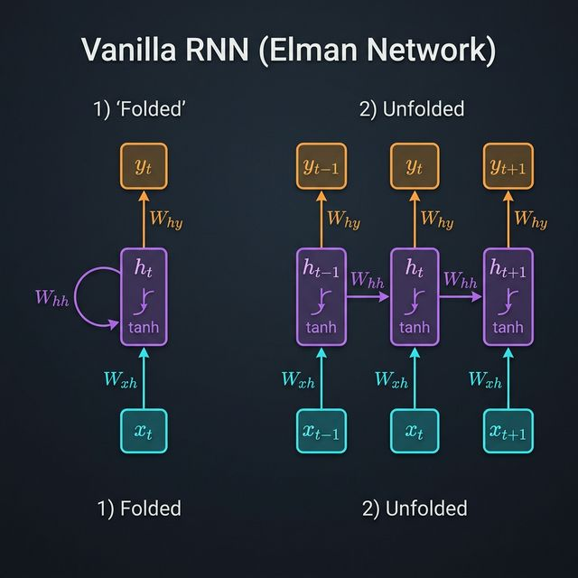

# RNN Architecture: Foundations of Sequential Memory

Technical breakdown of Recurrent Neural Networks (RNNs) from a first-principles approach: from single-state updates to gradient dynamics.

This folder contains isolated and tested implementations of the **Simple Recurrent Network (SRN)**, originally proposed by **Jeffrey L. Elman** in his landmark paper ["Finding Structure in Time" (Jeffrey L. Elman, 1990)](https://crl.ucsd.edu/~elman/Papers/fsit.pdf).

The architecture is often referred to as the **Elman Network**, the first successful model to use internal context units to represent time.

## Learning Roadmap

Follow this sequence to master the technical foundations of recurrent architectures before moving to gated units like LSTMs:

### Phase 1: The Hidden State

1. **[Hidden State Initialization](./rnn-hidden-state/explanation.md):** Defining the "zero-point" of memory and tensor dimensions.

### Phase 2: Forward Propagation

2. **[The RNN Cell](./rnn-cell/explanation.md):** The core linear transformation and non-linear activation ($tanh$) that defines the recurrence.
3. **[Forward Sequence](./rnn-forward-sequence/explanation.md):** Unrolling the recurrence through time ($T$) and managing hidden state persistence.

### Phase 3: Integration & Projection

4. **[Full Network Architecture](./rnn-full-network/explanation.md):** Combining the recurrent unrolling with output projection layers ($W_{hy}$) and Xavier initialization.

### Phase 4: Training & Backpropagation

5. **[BPTT (Backpropagation Through Time)](./rnn-bptt/explanation.md):** Calculating gradients through the unrolled graph using the chain rule.
6. **[Vanishing Gradients](./rnn-vanishing-gradients/explanation.md):** Mathematical analysis of the Jacobian matrix and why recursive products lead to signal decay.

---

> **Engineer's Note:** Each directory includes an `explanation.md` with the formal math, a `.py` implementation, and unit tests. Understanding the **Tensor Shapes** (e.g., `(Batch, Time, Hidden)`) is critical for successful implementation.
