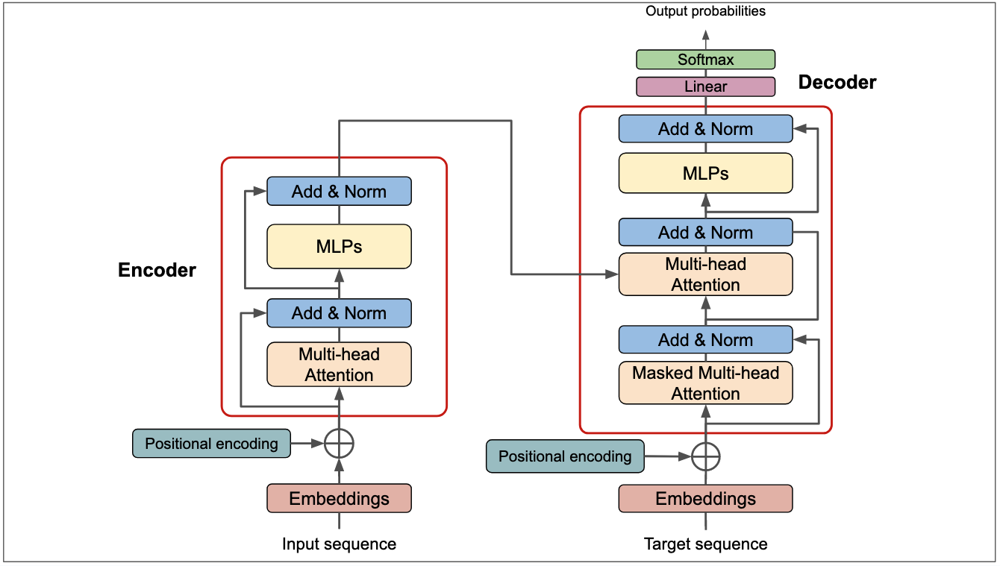

# Transformer Architecture: From Zero to Encoder Block

Welcome to the step-by-step technical guide to building the Transformer architecture the right way: understanding it piece by piece (Bottom-Up).

*Source: [AI Research Blog - The Transformer Blueprint](https://deeprevision.github.io/posts/001-transformer)*

This folder contains isolated and tested implementations of each critical subcomponent proposed in the original paper _"Attention Is All You Need"_ (Vaswani et al., 2017).

## Learning Roadmap

Follow this technical order to understand how raw text is transformed into complex context-rich representations:

### Phase 1: Understanding Input Data

1. **[Tokenization](./transformers-tokenization/explanation.md):** How text is split into units.
2. **[Embedding](./transformers-embedding/explanation.md):** From token to dense vector (`d_model`).
3. **[Positional Encoding](./transformers-positional-encoding/explanation.md):** Injecting the notion of order/position.

### Phase 2: Internal Processing Engines

4. **[Scaled Dot-Product Attention](./transformers-attention/explanation.md):** The heart of relationships ($Q, K, V$).
5. **[Multi-Head Attention](./transformers-multi-head-attention/explanation.md):** Parallelism across different representation subspaces.
6. **[Feed-Forward Network (FFN)](./transformers-feed-forward/explanation.md):** The non-linear network per position.

### Phase 3: Stability

7. **[Layer Normalization & Residuals](./transformers-layer-normalization/explanation.md):** Keeping gradients controlled and training stable.

### Phase 4: Main Assembly

8. **[Encoder Block](./transformers-encoder-block/explanation.md):** Uniting all previous layers to create the fundamental unidirectional processing block.

---

> Each subdirectory contains an explanation in `explanation.md`, the implementation in its respective `.py` file, and associated tests. We invite you to navigate in chronological order so you don't lose track of the matrix dimensions (Tensor Shapes).
