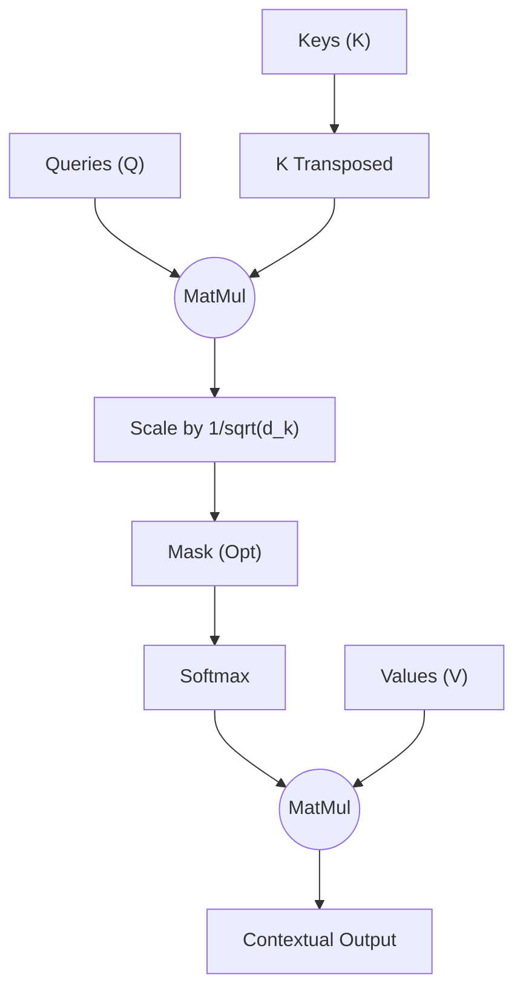

# Scaled Dot-Product Attention

## 1. Architectural Context

The **Scaled Dot-Product Attention** mechanism is the heart of the Transformer architecture, corresponding to **Phase 2**. It allows the model to focus on different parts of the input sequence for each processed element.

Instead of processing words sequentially or with fixed windows (like CNNs), attention computes a dynamic score between every pair of words in the sentence.

**Flow:**
`(Q, K, V) from prior layers` $\rightarrow$ `Dot Product & Scaled Softmax` $\rightarrow$ `Context-Aware Vectors`

## 2. Mathematical Foundation

The operation is mathematically defined as:

$$ \text{Attention}(Q, K, V) = \text{softmax}\left(\frac{QK^T}{\sqrt{d_k}}\right)V $$

Where:

- **$Q$ (Queries):** What we are looking for.
- **$K$ (Keys):** What we have available to compare against.
- **$V$ (Values):** The actual information we want to extract.
- **$d_k$:** Dimension of the keys (used for scaling to prevent vanishing gradients in the softmax).

## 3. Key Concepts & Implementation Steps

In the Python implementation of the `Attention` mechanism, several distinct mathematical operations occur sequentially:

1. **Query-Key Dot Product (`torch.matmul(Q, K.transpose(-2, -1))`)**:
   - _Why?_ We calculate the dot product between every Query and every Key. In linear algebra, a dot product measures alignment or similarity. A high dot product means the Query is very relevant to that Key. The `.transpose(-2, -1)` ensures we only swap the last two dimensions (Sequence Length and Embedding Dimension) so batch processing remains intact.

2. **Scaling (`scores / math.sqrt(d_k)`)**:
   - _Why?_ As the embedding dimension $d_k$ grows, the dot products tend to grow very large in magnitude. When passed to a Softmax function, large values push the function into regions with extremely small gradients (saturation), practically stopping the network from learning. Dividing by $\sqrt{d_k}$ keeps the variance of the scores around 1.

3. **Masking (`scores.masked_fill(mask == 0, -1e9)` - Optional)**:
   - _Why?_ In tasks like language translation (Decoders), the model shouldn't "look ahead" at future words. We apply a mask of zeros to these future positions. By replacing those zeros with $-10^9$ before the Softmax, $e^{-10^9}$ becomes exactly zero, completely nullifying their attention weight.

4. **Softmax (`F.softmax(..., dim=-1)`)**:
   - _Why?_ Converts the raw similarity scores into a probability distribution that sums to 1.0 across the sequence dimension. This yields our **Attention Weights**—percentages dictating how much focus to put on each word.

5. **Value Multiplication (`torch.matmul(attention_weights, V)`)**:
   - _Why?_ We multiply our percentage weights by the actual Values matrix $V$. Words with 90% attention will dominate the final vector for that position, while words with 0.1% attention will be ignored.

## 4. Tensor Shapes

Understanding the matrix multiplications is crucial to avoid broadcasting errors:

- **Inputs ($Q, K, V$)**: `(batch_size, seq_len, d_k)` (Assuming $d_v = d_k$)
- **$QK^T$ (Scores Matrix)**: `(batch_size, seq_len, seq_len)` - This represents the attention weight of every word with every other word.
- **Output ($Z$)**: `(batch_size, seq_len, d_v)`

## 4. Visual Flow (Mermaid)



## 5. Minimal Executable Example (Unit Example)

```python
import torch
import torch.nn.functional as F
import math

batch_size = 2
seq_len = 4
d_k = 8 # Dimension of queries and keys

# 1. Simulate Q, K, V (normally coming from linear layers)
Q = torch.randn(batch_size, seq_len, d_k)
K = torch.randn(batch_size, seq_len, d_k)
V = torch.randn(batch_size, seq_len, d_k)

# 2. Dot Product (Similarity scores)
scores = torch.matmul(Q, K.transpose(-2, -1)) # Shape: (2, 4, 4)

# 3. Scaling
scaled_scores = scores / math.sqrt(d_k)

# 4. Softmax (Attention Weights)
attention_weights = F.softmax(scaled_scores, dim=-1) # Shape: (2, 4, 4)

# 5. Multiply by Values
output = torch.matmul(attention_weights, V)

print(f"Output Shape: {output.shape}") # (2, 4, 8)
```
