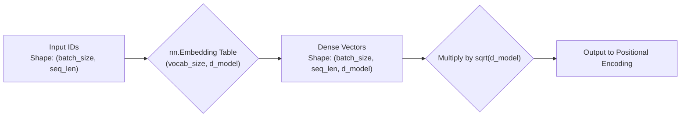

# Transformer Embedding Layer

## 1. Architectural Context

The Embedding layer is the actual **Step 1** inside the neural network. It takes the integers (IDs) produced by the [Tokenizer](../transformers-tokenization/explanation.md) and transforms them into continuous dense vectors. Without this layer, the network could not learn similarity relationships between words (e.g., king - man + woman = queen).

**Flow:**
`List of IDs` $\rightarrow$ `Embedding Layer` $\rightarrow$ `Dense Vectors + Positional Encoding`

In PyTorch, we use `nn.Embedding(vocab_size, d_model)` which acts as a massive lookup table.

## 2. Initialization and Mathematical Scaling

To maintain training stability (preventing exploding or vanishing gradients), we initialize the weights with a normal distribution:
$$\text{weights} \sim \mathcal{N}(0, \frac{1}{\sqrt{d_{model}}})$$

Furthermore, the original paper scales the embedding output by multiplying it by $\sqrt{d_{model}}$.
$$ \text{Output} = \text{Embedding}(token) \times \sqrt{d\_{model}} $$

This is done so that, when adding the Positional Encoding later, the mathematical magnitude of the word's meaning dominates over the magnitude of its position.

## 3. Tensor Shapes

It is vital to understand how dimensions change here:

- **Input**: Integer tensor of shape `(batch_size, seq_len)`
- **Output**: Floating-point tensor of shape `(batch_size, seq_len, d_model)`

Where:

- `batch_size`: How many sentences are processed in parallel.
- `seq_len`: How many tokens each sentence has.
- `d_model`: The length of the dense vector representing each token (e.g., 512).

## 4. Visual Data Flow (Mermaid)



## 5. Minimal Executable Example (Unit Example)

```python
import torch
import torch.nn as nn
from transformers_embedding import create_embedding_layer

# Hyperparameters
vocab_size = 10000
d_model = 512
batch_size = 2
seq_len = 10

# 1. Create Embedding layer
embedding_layer = create_embedding_layer(vocab_size, d_model)

# 2. Simulated input tensor (e.g., 2 sentences, 10 tokens each)
input_ids = torch.randint(0, vocab_size, (batch_size, seq_len))
print(f"Input Shape: {input_ids.shape}") # (2, 10)

# 3. Forward pass
embedded_output = embedding_layer(input_ids)

# 4. Verify output shape
print(f"Output Shape: {embedded_output.shape}") # (2, 10, 512)
```
