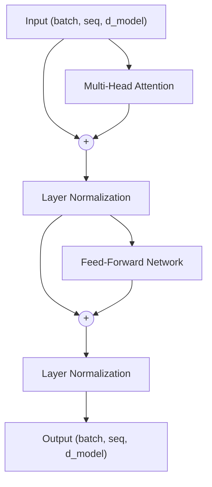

# Transformer Encoder Block

## 1. Architectural Context

This directory represents **Phase 4**: the full integration. The **Transformer Encoder Block** joins the individual pieces developed in earlier phases: Multi-Head Attention, the Feed-Forward Network, and Layer Normalization, bound together by residual connections.

An entire Encoder is built by stacking these blocks $N$ مرات (typically 6 in the original paper). It is designed to take a sequence of embeddings and return a sequence of context-aware embeddings of the exact same dimensions, allowing deep stacking.

**Flow:**
`Input Sequence` $\rightarrow$ `Multi-Head Attention` $\rightarrow$ `Add & Norm` $\rightarrow$ `Feed-Forward` $\rightarrow$ `Add & Norm` $\rightarrow$ `Output Sequence`

## 2. Mathematical Foundation

The overarching equation for the encoder block can be broken into two sequential sub-layer steps.

Assuming a "Post-Norm" architecture (as in the original paper):

1. **First Sublayer (Attention):**
   $$x_{mid} = \text{LayerNorm}(x + \text{MultiHeadAttention}(x, x, x))$$
2. **Second Sublayer (Feed-Forward):**
   $$\text{Output} = \text{LayerNorm}(x_{mid} + \text{FeedForward}(x_{mid}))$$

_Note: The addition operations ($x + ...$) are the **Residual (Skip) Connections**, critical for ensuring smooth gradient flow across deep networks._

## 3. Key Concepts & Implementation Steps

The Python implementation of the Encoder Block primarily serves as an orchestrator for the sub-modules:

1. **Self-Attention Sublayer (`MultiHeadAttention(x, x, x)`)**:
   - _Why?_ We feed the exact same input $x$ into the Query, Key, and Value parameters of the Multi-Head Attention module. This is why it's called _Self_-Attention; the sequence is looking at itself to find relationships between its own constituent words to build context.

2. **Residual Connections (`x + attention_output`)**:
   - _Why?_ Deep neural networks suffer from the "vanishing gradient" problem—as the error signal is propagated backward during training, repeated multiplication causes it to shrink to 0. A residual connection creates an "express lane" that allows gradients to bypass the complex mathematical transformations of the sublayer, making it possible to train networks with dozens of layers.

3. **Layer Normalization Alignment**:
   - _Why?_ Normalization can be applied "Post-Norm" (after the residual addition) or "Pre-Norm" (before the attention/FFN but inside the residual block). While the original paper used Post-Norm, modern variants (like GPT and LLaMA) tend to use Pre-Norm because it provides a cleaner gradient path straight from the input to the final output layer, leading to more stable training at scale.

4. **Feed-Forward Independence**:
   - _Why?_ The mathematical transformations in the Attention unit mix data from all over the sequence. The subsequent FFN step acts strictly on isolated positions to distill the complex relationships gathered in the previous step into a final, highly structured representation of the word at _that specific position_.

## 4. Tensor Shapes

A defining characteristic of the Encoder Block is that it is dimensionally transparent. Everything that goes in comes out with the exact same shape.

- **Input ($x$)**: `(batch_size, seq_len, d_model)`
- **Multi-Head Attention Output**: `(batch_size, seq_len, d_model)`
- **Residual + Norm**: `(batch_size, seq_len, d_model)`
- **Feed-Forward Output**: `(batch_size, seq_len, d_model)`
- **Final Output**: `(batch_size, seq_len, d_model)`

## 4. Visual Flow (Mermaid)



## 5. Minimal Executable Example (Unit Example)

Because the Encoder Block requires the internal sub-modules, a pure PyTorch example utilizes the built-in `nn.TransformerEncoderLayer`:

```python
import torch
import torch.nn as nn

batch_size = 2
seq_len = 10
d_model = 64
n_heads = 8
d_ff = 256

# 1. Instantiate the Encoder Block
# Note: PyTorch batch_first=True makes shape (batch, seq, feature) instead of (seq, batch, feature)
encoder_layer = nn.TransformerEncoderLayer(
    d_model=d_model,
    nhead=n_heads,
    dim_feedforward=d_ff,
    batch_first=True
)

# 2. Simulate input from Phase 1 (Embedding + Positional Encoding)
x = torch.randn(batch_size, seq_len, d_model)

# 3. Forward Pass through the block
output = encoder_layer(x)

print(f"Input Shape: {x.shape}")
print(f"Output Shape: {output.shape}") # (2, 10, 64)
```
