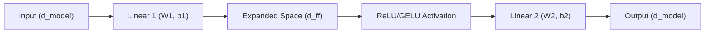

# Position-wise Feed-Forward Network (FFN)

## 1. Architectural Context

This component is a fundamental part of each Transformer layer (in **Phase 2**). While self-attention allows the model to relate different tokens in the sequence, the Feed-Forward Network provides the model with the ability to process each position independently and learn richer representations through non-linear transformations.

It receives the output from the Multi-Head Attention sublayer (after normalization) and processes each word vector in isolation.

**Flow:**
`Multi-Head Attention Output` $\rightarrow$ `FFN (Linear 1 -> ReLU/GELU -> Linear 2)` $\rightarrow$ `Final Transformer Block Output`

## 2. Mathematical Foundation

The FFN consists of two linear transformations with a ReLU activation in between:

$$FFN(x) = \text{max}(0, xW_1 + b_1)W_2 + b_2$$

Where:

- $W_1$ and $b_1$ project the input to a higher-dimensional space (typically $d_{ff} = 4 \times d_{model}$).
- $W_2$ and $b_2$ project the hidden representation back to the original $d_{model}$ dimension.

## 3. Key Concepts & Implementation Steps

The Python implementation (`feed_forward`) illustrates the simplicity and power of this sublayer using standard feed-forward properties applied over a sequence.

1. **Dimensional Expansion (`np.dot(x, W1) + b1`)**:
   - _Why?_ We multiply the incoming embeddings by a large weight matrix. In the original paper, $d_{model}$ is 512, and $d_{ff}$ is 2048 (4x larger). Expanding the feature space gives the network a massive "scratchpad" to map complex, non-linear relationships that the Attention mechanism couldn't express purely through linear dot products.

2. **The Non-Linearity (`np.maximum(0, hidden)` / ReLU)**:
   - _Why?_ Attention is mostly a series of linear combinations (weighted sums). Without non-linear activation functions like ReLU (or modern variants like GELU/Swish), the entire deep Transformer would collapse into the equivalent of a single simple linear layer. ReLU introduces the non-linearity required to learn complex data distributions, dropping negative signals and passing positive ones.

3. **Dimensional Contraction (`np.dot(relu_out, W2) + b2`)**:
   - _Why?_ After processing in the expanded state, the second linear transformation squashes the representation back down to the $d_{model}$ size. This exact contraction is mandatory because the Transformer architecture relies on **Residual Connections**—we have to be able to add the original input $x$ to the output of this function, which requires identically sized matrices.

## 4. Tensor Shapes

The transformations expand the dimensionality to allow the model to learn more complex features before contracting it back to maintain consistent dimensionality throughout the Transformer stack.

- **Input ($x$)**: `(batch_size, seq_len, d_model)`
- **First Linear Transformation ($W_1$)**: `(batch_size, seq_len, d_ff)`
- **Second Linear Transformation ($W_2$)**: `(batch_size, seq_len, d_model)`

_Note: The sequence length is preserved. The operation happens across the last dimension._

## 4. Visual Flow (Mermaid)



## 5. Minimal Executable Example (Unit Example)

```python
import numpy as np

batch_size = 2
seq_len = 5
d_model = 64
d_ff = 256 # Typically 4x d_model

def feed_forward(x, W1, b1, W2, b2):
    # First linear transformation (expansion)
    hidden = np.dot(x, W1) + b1
    # ReLU activation (non-linearity)
    relu_out = np.maximum(0, hidden)
    # Second linear transformation (contraction)
    output = np.dot(relu_out, W2) + b2
    return output

# 1. Dummy Inputs and Weights
x = np.random.randn(batch_size, seq_len, d_model)
W1 = np.random.randn(d_model, d_ff)
b1 = np.random.randn(d_ff)
W2 = np.random.randn(d_ff, d_model)
b2 = np.random.randn(d_model)

# 2. Pass through FFN
output = feed_forward(x, W1, b1, W2, b2)

print(f"Input Shape: {x.shape}")
print(f"Output Shape: {output.shape}") # Stays (2, 5, 64)
```
