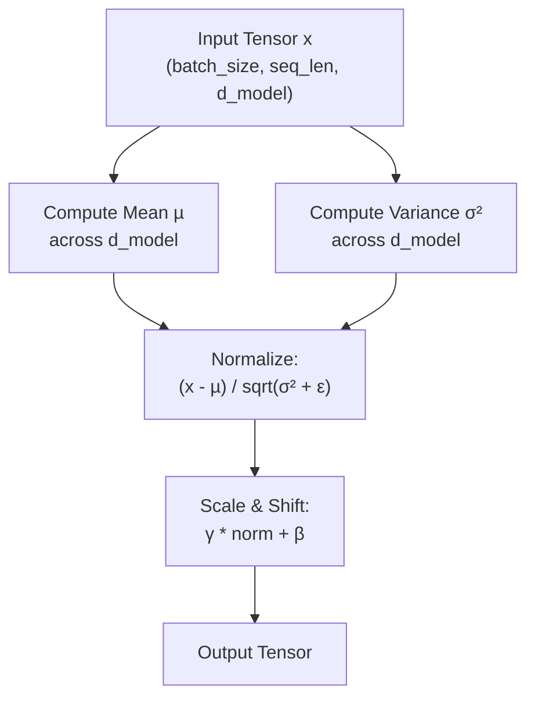

# Layer Normalization

## 1. Architectural Context

**Layer Normalization** is a pivotal component in **Phase 3** of the Transformer architecture. Its goal is to stabilize training, allow for higher learning rates, and reduce convergence time by normalizing the activations of intermediate layers across the feature dimension.

In deep networks, activations from each layer can vary significantly in magnitude, leading to vanishing or exploding gradients (Internal Covariate Shift). Layer Norm solves this by ensuring that for each sample, activations have a **mean of 0** and a **standard deviation of 1**.

**Flow:**
`Output from Sublayer (Attention or FFN)` $\rightarrow$ `Residual Addition` $\rightarrow$ `Layer Normalization` $\rightarrow$ `Input to Next Sublayer`
_(Note: Modern implementations often use "Pre-Norm", applying normalization before the sublayer, but the concept is the same)._

## 2. Mathematical Foundation

For an input vector $x$ of dimension $d_{model}$:

$$LayerNorm(x) = \gamma \cdot \frac{x - \mu}{\sqrt{\sigma^2 + \epsilon}} + \beta$$

Where:

1.  **Mean ($\mu$)**: The average of values in the feature dimension.
    $$\mu = \frac{1}{d_{model}} \sum_{i=1}^{d_{model}} x_i$$
2.  **Variance ($\sigma^2$)**: The spread of the values.
    $$\sigma^2 = \frac{1}{d_{model}} \sum_{i=1}^{d_{model}} (x_i - \mu)^2$$
3.  **Epsilon ($\epsilon$)**: A microscopic constant (e.g., $10^{-5}$) to prevent division by zero.
4.  **Learnable Parameters ($\gamma$ and $\beta$)**: Scale (gamma) and shift (beta) that allow the network to "de-normalize" if the optimization process determines that the task requires it.

## 3. Key Concepts & Implementation Steps

While PyTorch provides `nn.LayerNorm`, understanding the manual calculation illuminates the "why" behind this layer:

1. **Mean and Variance Calculation (`x.mean(dim=-1)`, `x.var(dim=-1)`)**:
   - _Why?_ We calculate the statistics exclusively across the last dimension (`d_model`) for _each_ token independently. This is what distinguishes it from Batch Normalization (which calculates across the batch size). By treating each token as an independent entity, Layer Norm works perfectly on sequences of varying lengths and with batch sizes of 1 (unlike BatchNorm).

2. **Normalization (`(x - mean) / sqrt(var + eps)`)**:
   - _Why?_ We shift the distribution so it's centered around 0 (subtract mean) and has a standard spread of 1 (divide by standard deviation). The small $\epsilon$ (epsilon) is added to the variance _before_ taking the square root to prevent a division-by-zero crash in the rare event a token has identical values across all its embedding dimensions.

3. **Affine Transformation (`x_norm * gamma + beta`)**:
   - _Why?_ Normalization rigidly forces values into a tight $[ -1, 1 ]$ bell curve. Sometimes, the neural network _needs_ the values to be larger or shifted to activate a ReLU function properly. The parameters $\gamma$ (gamma/scale) and $\beta$ (beta/bias) are initialized to 1 and 0 respectively, but the model learns during training via backpropagation if it needs to alter the distribution.

## 4. Tensor Shapes

Unlike Batch Normalization, Layer Normalization operates independently on each token sequence element, completely ignoring the batch size.

- **Input ($x$)**: `(batch_size, seq_len, d_model)`
- **Mean & Variance (Internal)**: Computed over the last dimension (`d_model`).
- **Output**: `(batch_size, seq_len, d_model)`

## 4. Visual Flow (Mermaid)



## 5. Minimal Executable Example (Unit Example)

```python
import torch
import torch.nn as nn

batch_size = 2
seq_len = 5
d_model = 64

# 1. Instantiate the layer (PyTorch has it built-in)
# It requires the normalized shape (usually just the last dimension)
layer_norm = nn.LayerNorm(d_model)

# 2. Simulate input from a previous layer
x = torch.randn(batch_size, seq_len, d_model) * 10 + 5  # Mean 5, high variance

# 3. Apply normalization
output = layer_norm(x)

# 4. Verify properties
print(f"Output Shape: {output.shape}") # (2, 5, 64)
print(f"Mean before: {x[0, 0].mean().item():.3f}")
print(f"Mean after: {output[0, 0].mean().item():.3f} (Approx 0)")
print(f"Std dev after: {output[0, 0].std().item():.3f} (Approx 1)")
```
