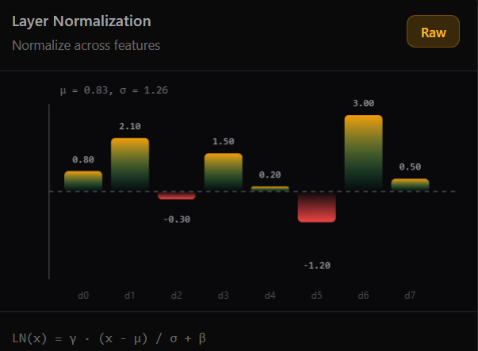
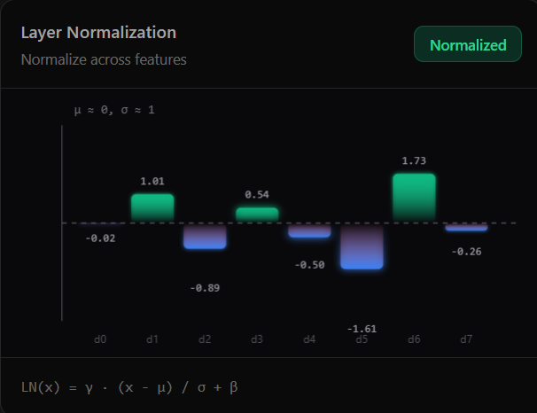

# Layer Normalization

**Layer Normalization** is a fundamental piece of the Transformer architecture. Its goal is to stabilize training and reduce convergence time by normalizing layer activations across the feature dimension.

## Why Do We Need It?

In deep networks like the Transformer, activations from each layer can vary significantly in magnitude. This can lead to:

- **Vanishing or Exploding Gradients**: Making training unstable.
- **Slow Learning**: The network spends a lot of time adapting to changes in the distribution of inputs (Internal Covariate Shift).

Layer Norm solves this by ensuring that for each sample, activations have a **mean of 0** and a **standard deviation of 1**.

## Anatomy of Layer Norm

Unlike Batch Normalization, which normalizes across different samples in a batch, **Layer Normalization normalizes across the features of a single sample**.

### The Formula

For an input vector $x$ of dimension $d_{model}$:

$$LayerNorm(x) = \gamma \cdot \frac{x - \mu}{\sqrt{\sigma^2 + \epsilon}} + \beta$$

Where:

1.  **Mean ($\mu$)**: The average of values in the feature dimension.
    $$\mu = \frac{1}{d} \sum_{i=1}^{d} x_i$$
2.  **Variance ($\sigma^2$)**: The spread of the values.
    $$\sigma^2 = \frac{1}{d} \sum_{i=1}^{d} (x_i - \mu)^2$$
3.  **Epsilon ($\epsilon$)**: A very small constant (e.g., $10^{-6}$) to prevent division by zero.
4.  **Learnable Parameters ($\gamma$ and $\beta$)**: Scale (gamma) and shift (beta) that allow the network to "de-normalize" if it determines it is beneficial for the task.

## Step-by-Step Process Visualization

Imagine an input vector: `[1, 2, 3, 4]`

1.  **Calculate Mean**: (1+2+3+4)/4 = **2.5**
2.  **Calculate Variance**: $((1-2.5)^2 + (2-2.5)^2 + (3-2.5)^2 + (4-2.5)^2) / 4 = **1.25**
3.  **Normalize**: Subtract mean and divide by the square root of variance.
    - $(1 - 2.5) / \sqrt{1.25} \approx -1.34$
    - $(2 - 2.5) / \sqrt{1.25} \approx -0.45$
    - $(3 - 2.5) / \sqrt{1.25} \approx 0.45$
    - $(4 - 2.5) / \sqrt{1.25} \approx 1.34$
4.  **Apply Gamma and Beta**: If $\gamma=1$ and $\beta=0$, the result remains as above.

## Visual Impact

The following plots illustrate the effect of Layer Normalization on a random tensor. Notice how the distribution of values is centered and scaled.

### Raw Activations

### Normalized Activations

### Comparative Analysis 🔍

By comparing the two visualizations above, we can observe the mathematical transformation in action:

1.  **Re-centering (Mean $\rightarrow$ 0)**:
    - In the **Raw** image, the distribution is shifted upwards with a mean of **0.83**.
    - In the **Normalized** image, the mean is effectively **0**. Notice how the baseline (dashed line) now balanced the positive and negative activations.
2.  **Rescaling (Std Dev $\rightarrow$ 1)**:
    - The **Raw** values had a standard deviation of **1.26**, with some peaks reaching 3.00.
    - The **Normalized** values are scaled to a standard deviation of **1**. The previous peak of 3.00 has been "squashed" down to approximately 1.73, making the gradients more predictable and stable during backpropagation.
3.  **Consistency**:
    - Regardless of how high or low the original values were, Layer Norm ensures that the input to the next layer follows a standard distribution. This prevents any single feature or sample from dominating the learning process due to high magnitude.

## Layer Norm vs Batch Norm

| Feature                   | Batch Normalization             | Layer Normalization                 |
| :------------------------ | :------------------------------ | :---------------------------------- |
| **Normalized across**     | Samples in a batch              | Features of the sample              |
| **Batch Dependency**      | High (fails with small batches) | None (works the same with batch=1)  |
| **Main Use Case**         | Convolutional Networks (CNN)    | Sequence Models (Transformers, RNN) |
| **Training vs Inference** | Behaves differently             | Identical behavior                  |

In the Transformer, Layer Norm is applied **before** Multi-Head Attention and **before** the Feed-Forward Network (in modern "Pre-LN" designs), or after residual connections (original "Post-LN" design).
