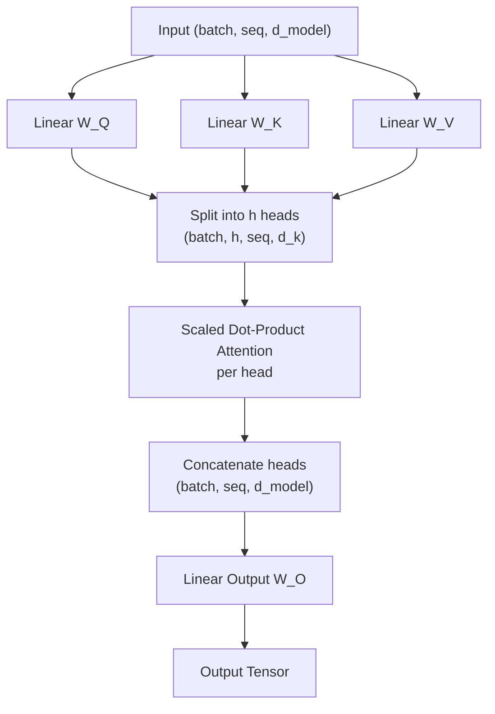

# Multi-Head Attention

## 1. Architectural Context

While single-head attention can focus on specific parts of a sequence, **Multi-Head Attention** allows the model to simultaneously attend to information from different representation subspaces at different positions.

If one head focuses on syntax (e.g., subject-verb agreement), another head can focus on semantics (e.g., the relationship between a pronoun and its noun). This is a crucial component of **Phase 2**, commonly taking the output of the Positional Encoding or a previous Transformer block.

**Flow:**
`Inputs` $\rightarrow$ `Linear Projections (Splitting into Heads)` $\rightarrow$ `Scaled Dot-Product Attention (Parallel)` $\rightarrow$ `Concatenation & Final Linear Projection`

## 2. Mathematical Foundation

The operation is defined as:

$$ \text{MultiHead}(Q, K, V) = \text{Concat}(\text{head}\_1, \dots, \text{head}\_h)W^O $$

Where each head is:

$$ \text{head}\_i = \text{Attention}(QW_i^Q, KW_i^K, VW_i^V) $$

And:

- $W_i^Q, W_i^K, W_i^V$ are projection matrices for each head.
- $W^O$ is the final output projection matrix.
- $h$ is the number of heads.
- $d_k = d_{v} = d_{model} / h$ (This ensures computational cost is similar to single-head attention).

## 3. Key Concepts & Implementation Steps

Implementing Multi-Head Attention efficiently in PyTorch requires manipulating tensors rather than using an actual `for` loop over $h$ heads.

1. **Linear Projections**:
   - _Why?_ The inputs (often the same $X$ matrix for Self-Attention) are projected through learnable linear layers (`nn.Linear`) into $Q, K, V$. This allows the model to map the input embeddings into unique sub-spaces specifically optimized for asking (Queries), answering (Keys), and providing context (Values).

2. **Splitting Heads via Reshape & Transpose (`.view(..., h, d_k).transpose(1, 2)`)**:
   - _Why?_ Instead of running $h$ separate attention functions, we slice the embedding dimension ($d_{model}$) into $h$ chunks of size $d_k$. We do `reshape` and then `transpose` so the 'heads' dimension sits right next to the 'batch' dimension. Matrix multiplication in PyTorch automatically broadcasts over these leading dimensions, effectively processing all heads in parallel.

3. **Parallel Attention Function**:
   - _Why?_ We pass the split $Q,K,V$ tensors to the standard Scaled Dot-Product Attention function. Because of the transpose trick in step 2, the Attention logic calculates scores purely between tokens _within the exact same head_.

4. **Concatenation via Transpose & Reshape (`.transpose(1, 2).contiguous().view(...)`)**:
   - _Why?_ Once attention is applied, we must bring the 'heads' back together. We transpose the dimensions back to their original order and `.view` (or reshape) them, merging the $h$ chunks back into a single $d_{model}$ vector per token. `.contiguous()` is often required in PyTorch after a memory-shifting transpose.

5. **Final Output Projection ($W^O$)**:
   - _Why?_ The concatenated heads are mixed together by one last Linear layer to create a cohesive final representation where information collected across all heads is synthesized.

## 4. Tensor Shapes

Tracking shapes through Multi-Head Attention is complex due to the tensor reshaping operations:

- **Inputs ($Q, K, V$)**: `(batch_size, seq_len, d_model)`
- **Linear Projections**: Remains `(batch_size, seq_len, d_model)`
- **Splitting into Heads (Reshape & Transpose)**: `(batch_size, h, seq_len, d_k)`
- **Attention Output (Per Head)**: `(batch_size, h, seq_len, d_k)`
- **Concatenation (Transpose & Reshape)**: `(batch_size, seq_len, d_model)`
- **Final Output Projection ($W^O$)**: `(batch_size, seq_len, d_model)`

## 4. Visual Flow (Mermaid)



## 5. Minimal Executable Example (Unit Example)

```python
import torch
import torch.nn as nn
from multi_head_attention import multi_head_attention

batch_size = 2
seq_len = 5
d_model = 64
num_heads = 8
d_k = d_model // num_heads # 8

# 1. Simulated input (usually X = Q = K = V for Self-Attention)
X = torch.randn(batch_size, seq_len, d_model)

# 2. Projection Weights (Normally nn.Linear blocks)
W_q = nn.Linear(d_model, d_model).weight
W_k = nn.Linear(d_model, d_model).weight
W_v = nn.Linear(d_model, d_model).weight
W_o = nn.Linear(d_model, d_model).weight

# 3. Apply Multi-Head Attention function
# Note: In a real nn.Module, inputs pass through Linear layers first
output, attention_weights = multi_head_attention(
    X, X, X, W_q, W_k, W_v, W_o, num_heads
)

print(f"Input Shape: {X.shape}")
print(f"Output Shape: {output.shape}") # Should be (2, 5, 64)
print(f"Attention Weights Shape: {attention_weights.shape}") # (2, 8, 5, 5) => (batch, heads, seq, seq)
```
