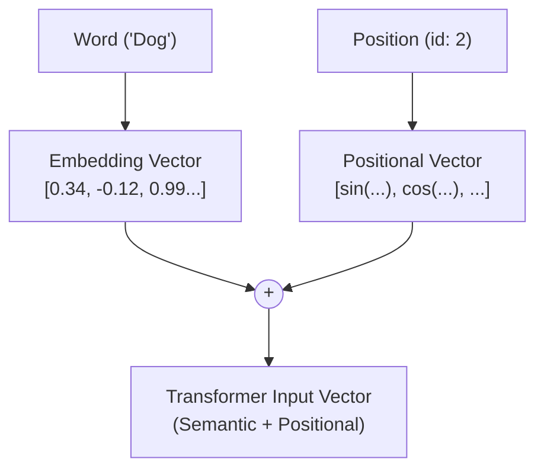

# Positional Encoding: Giving Order to Words

## 1. Architectural Context

Positional Encoding is **Step 1.5** of the architecture. The Transformer processes all tokens at once, so it is inherently "blind" to word sequence ("The dog bites the cat" and "The cat bites the dog" would be identical without this).

To fix this, we inject position information directly by adding it to the vector resulting from the [Embedding Layer](../transformers-embedding/explanation.md).

**Flow:**
`Embedding Output` + `Positional Encoding` $\rightarrow$ `Transformer Blocks (Attention)`

## 2. Mathematical Foundation

We do not concatenate; rather, we add the positional vector $PE$ element-wise to the embedding. The $PE$ vector has the same size $d_{model}$.

For a position $pos$ and vector dimension $i$:

Even Indices ($2i$):
$$PE_{(pos, 2i)} = \sin\left(\frac{pos}{10000^{2i/d_{model}}}\right)$$

Odd Indices ($2i+1$):
$$PE_{(pos, 2i+1)} = \cos\left(\frac{pos}{10000^{2i/d_{model}}}\right)$$

The sinusoidal functions allow the model to learn to attend based on _relative_ positions easily due to their algebraic properties.

## 3. Key Concepts & Implementation Steps

In the Python `positional_encoding` function, we avoid `for` loops and rely on vectorized Tensor operations:

1. **Precomputing the Divisor Term (`div_term`)**: Instead of calculating $10000^{2i/d_{model}}$ directly inside a loop, we compute `exp(arange * -(log(10000.0) / d_model))`.
   - _Why?_ Calculating powers of large numbers like 10000 can lead to floating-point representation instabilities. Transforming the denominator into the Log-Space (`exp(log)`) is exponentially faster for CPUs/GPUs and numerically robust.

2. **Vectorized Even / Odd Splitting**: We populate the `pe_matrix` using list slicing features (e.g., `pe[:, 0::2] = sin(...)` and `pe[:, 1::2] = cos(...)`).
   - _Why?_ PyTorch and NumPy are highly optimized for C-level contiguous memory operations. Operating on slices rather than iterating over $i$ row-by-row speeds up tensor creation significantly.

3. **Additive Injection**: In the forward pass, we perform $X = X + PE$. We do not use `torch.cat()`.
   - _Why?_ Concatenating would increase the dimension size (e.g., from 512 to 1024), forcing every downstream linear layer to have double the weights. Because the neural network operates in high-dimensional space, adding the signals mathematically allows the model to separate "content" and "position" internally without requiring extra parameters.

## 4. Tensor Shapes

Positional Encoding generates a constant matrix. When adding it in the Forward Pass:

- **Input $x$ (Embeddings)**: `(batch_size, seq_len, d_model)`
- **`self.pe` (Internal Positional matrix)**: `(1, max_len, d_model)`
  _Note: Dimension 1 allows PyTorch to perform "Broadcasting," adding the same position to all elements in the batch simultaneously._
- **Output**: `(batch_size, seq_len, d_model)`

Dimensions do not change; only the numerical value is perturbed.

## 4. Visual Flow (Mermaid)



## 5. Minimal Executable Example (Unit Example)

```python
import torch
from positional_encoding import positional_encoding

batch_size = 2
seq_len = 5
d_model = 64

# 1. Simulate Embedding layer output
x_embeddings = torch.randn(batch_size, seq_len, d_model)

# 2. Generate positional tensor
# Creates a (seq_len, d_model) matrix with sines and cosines
pe_matrix = positional_encoding(seq_len, d_model)

# 3. Add them (Broadcasted sum over batch dimension)
# Typically, in module implementations, this is stored in a buffer
output = x_embeddings + pe_matrix.unsqueeze(0) # Expand for batch

print(f"Embedding Shape: {x_embeddings.shape}")
print(f"PE Matrix Shape: {pe_matrix.unsqueeze(0).shape}")
print(f"Final Input Shape: {output.shape}") # Remains (2, 5, 64)
```
